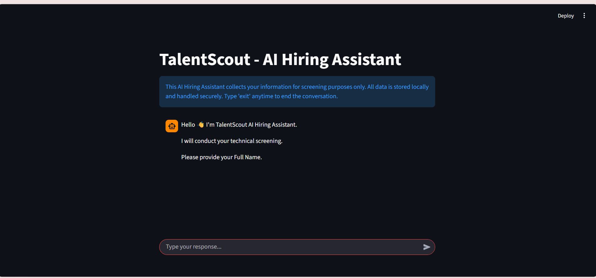
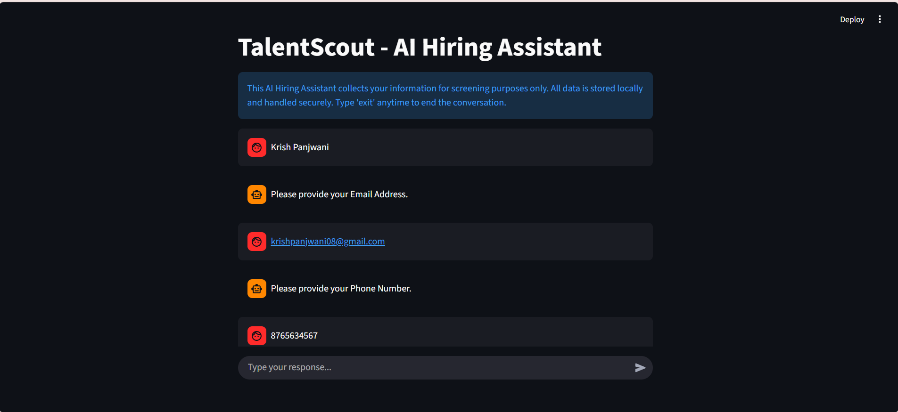
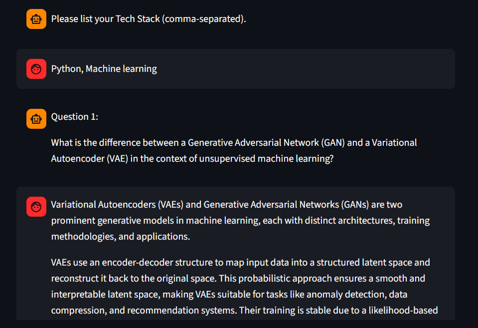
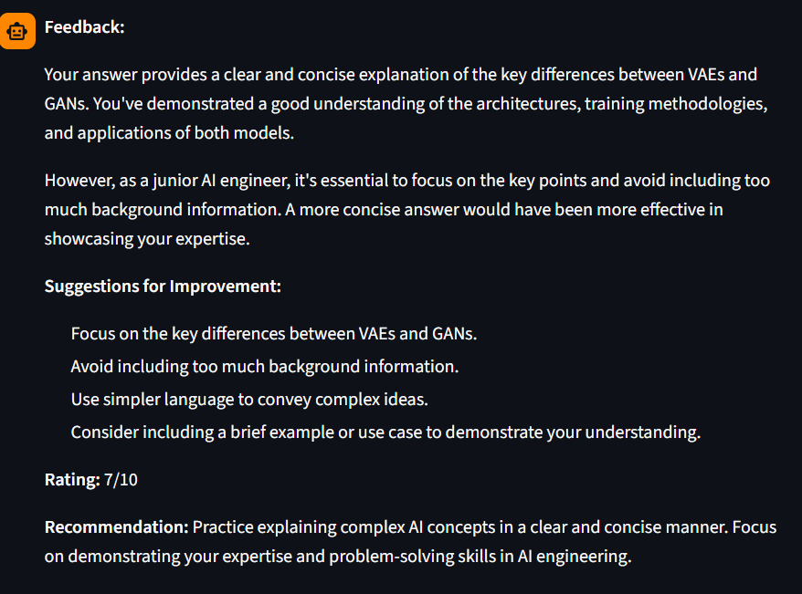

# Hiring-Assitant
AI-powered interview assistant designed to collect candidate information, recommend suitable technology domains based on user interests, and conduct mock interviews with automated answer evaluation and feedback generation.

# 🧑‍💼 AI Hiring Assistant

AI-powered interview assistant designed to collect candidate information, recommend suitable technology domains based on user interests, and conduct mock interviews with automated answer evaluation and feedback generation.

---

## 🚀 Features

- Candidate information collection
- Mock interview simulation
- AI-generated answer evaluation
- Feedback generation for improvement
- Interactive Streamlit user interface

---

## 🛠️ Tech Stack

- Python
- Streamlit
- Groq API
- NLP
- TextBlob
- python-dotenv

---

## ⚙️ Installation

Clone the repository:

```bash
git clone https://github.com/vartikaX-ai/Hiring-Assitant.git
```

Install dependencies:

```bash
pip install -r requirements.txt
```

Run the application:

```bash
streamlit run hiring.py
```

---

## 🔑 Environment Variables

Create a `.env` file and add your Groq API key:

```env
GROQ_API_KEY=your_api_key
```

---

## 📸 Screenshots
## 📸 Screenshots

### Home Page


###User Collection Page


### Mock Interview


### Feedback


## 📌 Future Improvements

- Resume-based interview customization
- Voice-based interview interaction
- Advanced NLP-based evaluation
- Cloud deployment support

---

## 📄 License

This project is licensed under the MIT License.
